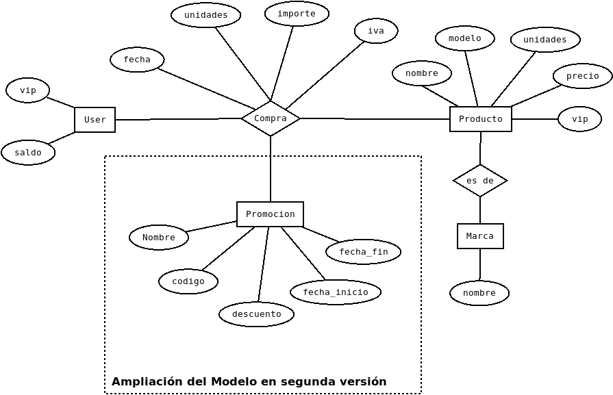

# DWES -Django-Models

El objetivo de esta práctica es profundizar en los modelos de Django.
Se pretende crear una aplicación que permita gestionar la base de una 
aplicación web de venta de productos.

Se solicita:

* **Creación de los modelos** necesarios para su alta y administración 
en django admin
* **CRUD de productos** sólo para el administrador en la ruta tienda/admin/
   * **listado** de los productos de la tienda
      * Debe tener enlaces para el resto de acciones 
   * **edicion/\<int:pk>** Editar información de un producto
   * **eliminar/\<int:pk>** Debe solicitar confirmación
   * **nuevo** Permite introducir un nuevo producto
* **Compra de productos**. Tiene lugar en la URL tienda/
  * **compra** se muestra un listado de los productos y es posible buscar.
  * **checkout** se muestra información detallada del producto, se introducen 
  las unidades y se confirma la compra.
* **Informes** sólo para el administrador en la ruta tienda/informes/
  * Productos por marca. Primero muestra las marcas y 
  después un listado con los productos de la marca que se seleccione
  * Top ten productos vendidos. Mayor número de unidades vendidas
  * Compras de un usuario
  * Top ten mejores clientes. Por importe gastado.
